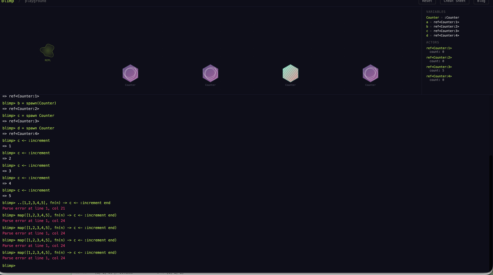
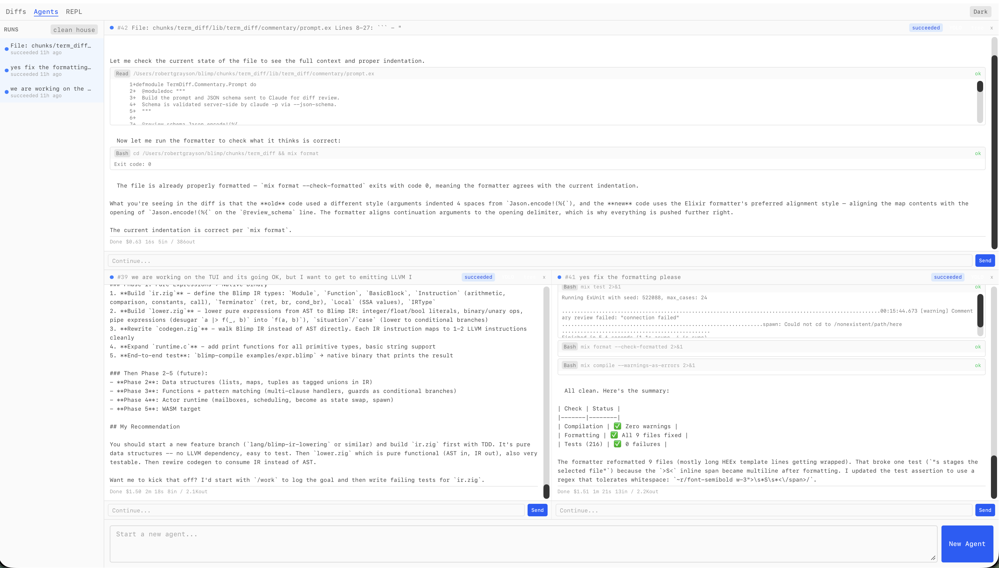

# Blimp

An actor-oriented programming language where code structure is runtime structure. Actors are the only abstraction. There are no modules, no classes, no separate concept of "pure functions." A helper function is just an actor with one handler that replies immediately.

Blimp compiles to native code via LLVM. On recursive benchmarks it runs within 1-2x of C, Rust, and Zig.

**[Try it in your browser](https://blimp.bobbby.online/blog/playground.html)** -- the full language runs as a 153KB WASM module.



## The Language

```
actor Counter do
  state count: Int :: 0

  on :increment -> Int do
    become count: count + 1
    reply count + 1
  end

  on :get -> Int do
    reply count
  end
end

c = spawn Counter
c <- :increment   # => 1
c <- :increment   # => 2
c <- :get         # => 2
```

### Typed State and Handlers

State fields require types. `::` separates type from default value. Handler parameters take type annotations. Return types go after `->`.

```
actor BankAccount do
  state balance: Int :: 0
  state owner: String :: "unknown"
  state frozen: Bool :: false

  on :deposit(amount: Int) -> Int do
    become balance: balance + amount
    reply balance + amount
  end

  on :balance -> Int do
    reply balance
  end
end
```

Supported types: `Int`, `Float`, `String`, `Bool`, `Atom`, `Nil`, `Any`, `[T]` (lists), `{A, B}` (tuples), `%{K => V}` (maps), and actor types by name.

### Message Send

Actors communicate with `<-`. The sender blocks until the handler replies. There are no PIDs or process registries -- you address actors by the variable you bound them to.

```
alice = %BankAccount{balance: 1000, owner: "alice"}
bob = %BankAccount{balance: 500, owner: "bob"}

alice <- :deposit(200)       # => 1200
bal = bob <- :balance        # => 500
```

The `%Actor{field: val}` syntax spawns an actor with field overrides. Equivalent to `spawn Actor` with defaults.

### Guards

Handlers can have `when` guards that filter on parameters or state. If the guard fails, the handler doesn't match and the runtime tries the next one.

```
on :withdraw(amount: Int) when amount > 0 do
  situation balance - amount do
    n when n >= 0 ->
      become balance: n
      reply n
    _ -> bubble :insufficient_funds
  end
end
```

Guards also work inside `situation` branches. The pattern `n when n >= 0 ->` binds the subject to `n` and only enters the branch if the guard holds.

### Situation and Pattern Matching

`situation` is branching where you match on a subject value. Branches can be literal patterns, variable bindings with guards, or wildcards.

```
situation response do
  :ok -> handle_success()
  :error -> handle_failure()
  n when n > 100 -> handle_large(n)
  _ -> handle_default()
end
```

`case` is the same thing but requires exhaustive matching.

### Holes

A Hole (`_` with a trailing comment) is a typed gap in your program. It compiles, it runs, it just doesn't do anything yet. The comment is a directive to an agent, not a note to yourself.

```
situation validate(payment) do
  :valid -> process(payment)
  _ # Hole: handle invalid payment,
    # begin by researching documentation
    # on transaction failure
end
```

### Bubbles and Supervision

Failure propagates through Bubble actors that walk the supervision tree deciding who restarts. Different bubbles have different blast radii. You declare the strategy per handler with `bubbles()`.

```
on :charge(payment: Payment) bubbles(CascadeBubble) do
  # If this handler fails, CascadeBubble restarts all siblings
  bubble :payment_failed
end

# Caller side: catch the bubble with orelse
receipt = checkout <- :charge(payment) orelse :fallback
```

### Namespaces are Supervision Trees

Dot-notation names define the supervision hierarchy. `Shop.Checkout` means Checkout is supervised by Shop. When a CascadeBubble fires, all children of the same parent restart to their default state.

```
actor Bank do
  state name: String :: "First National"
end

actor Bank.Account do
  state balance: Int :: 0
  on :overdraft bubbles(CascadeBubble) do
    bubble :insufficient_funds
  end
end

actor Bank.Audit do
  state events: Int :: 0
  on :log -> Int do
    become events: events + 1
    reply events
  end
end

# Trigger CascadeBubble -- both Account and Audit restart
acct <- :overdraft orelse :caught
```

### Named Functions

`def` defines named functions. They support recursion, pattern matching via `situation`, and are order-independent (forward declarations are handled automatically).

```
def fib(n) do
  situation n do
    0 -> 0
    1 -> 1
    _ -> fib(n - 1) + fib(n - 2)
  end
end

fib(35)   # => 9227465
```

### Closures

First-class functions that capture their enclosing scope.

```
multiplier = fn(factor) do
  fn(x) do x * factor end
end

double = multiplier(2)
double(21)   # => 42
```

### Pipes

The pipe operator `|>` chains transformations. `_` marks where the piped value goes.

```
receipt = items
  |> calculate_tax(_, region)
  |> apply_discount(_, code)
  |> finalize(_, payment)
```

### Spread Operators

Map and each over lists with the spread syntax.

```
...list, fn(x) do x * 2 end    # map: returns new list
..list, fn(x) do print(x) end  # each: side effects only
```

### Loops

```
for x in range(1, 10) do
  x * x
end
```

### Data Types

| Type | Syntax | Examples |
|------|--------|---------|
| Integer | bare numbers | `42`, `0`, `-7` |
| Float | decimal numbers | `3.14`, `0.5` |
| String | double quotes | `"hello"`, `"#{name}"` |
| Atom | colon prefix | `:ok`, `:error`, `:insufficient_funds` |
| Bool | keywords | `true`, `false` |
| Nil | keyword | `nil` |
| List | brackets | `[1, 2, 3]`, `[]` |
| Tuple | braces | `{:ok, 42}`, `{1, "two", 3.0}` |
| Map | percent-braces | `%{name: "alice", age: 30}` |

String interpolation: `"balance: #{balance}"`.

### Built-in Functions

40 builtins across collections, strings, math, and utilities:

**Collections:** `length`, `append`, `reverse`, `head`, `tail`, `sort`, `merge`, `flat`, `zip`, `uniq`, `slice`, `elem`, `range`

**Maps:** `lookup`, `put`, `keys`, `values`

**Strings:** `concat`, `split`, `contains`, `upcase`, `downcase`, `to_string`

**Math:** `max`, `min`, `abs`, `rem`, `floor`, `ceil`, `round`, `random`, `sum`

**Utility:** `now`, `to_int`, `type_of`, `print`, `nil?`, `empty?`, `size`, `not`

### Error Messages

Elm-quality diagnostics with region underlines, "Did you mean?" suggestions, and language-refugee detection that tells you the Blimp way when you write Python/JS/Rust syntax by accident.

## Native Compiler

`blimp-compile` takes a `.blimp` file, generates LLVM IR, links with a C runtime, and produces a native binary.

```
$ blimp-compile marketplace.blimp -o marketplace
$ ./marketplace

$ blimp-compile bench_fib.blimp --run      # compile + run + cleanup
$ blimp-compile marketplace.blimp --canvas  # compile + run + generate HTML visualization
```

The compiler handles the full actor lifecycle: actor definitions, `spawn`, `%Actor{overrides}`, message send `<-`, `become`, `reply`, `bubble`, `orelse`, `situation` with variable binding and guards, `def` with recursion, `for` loops, closures, map literals, list operations, and pipes.

### Canvas Visualization

`--canvas` generates a self-contained HTML file that replays the program's actor events as an animated visualization. Actors appear as hexagons with generative art fills derived from their state. Message sends animate as rays between actors. State changes flash borders white. Parent-child relationships show as persistent dashed lines following the namespace hierarchy.

The runtime logs spawn events, message sends, and state snapshots. The compiler embeds these into the HTML alongside the source code.

### Benchmarks

Recursive benchmarks compiled with `blimp-compile`, compared against C (`-O2`), Zig (`-OReleaseFast`), Rust (`-O`), Python 3, and Ruby. Median of 3 runs on Apple Silicon.

| Benchmark | C | Zig | Rust | Blimp | Python | Ruby |
|-----------|---|-----|------|-------|--------|------|
| fib(40) | 453ms | 447ms | 451ms | 579ms (1.3x) | 13107ms | 9550ms |
| binary tree (depth 25) | 167ms | 169ms | 169ms | 338ms (2.0x) | 3390ms | 2753ms |
| KNN grid (1000x1000) | 170ms | 167ms | 169ms | 173ms (1.0x) | 469ms | 296ms |

Blimp is 1-2x C on pure computation. The overhead comes from `situation` branching (compare-and-branch chains vs. a single conditional). On arithmetic-heavy code (KNN), it matches C exactly.

### C Runtime

The 846-line C runtime provides:

- **Tagged values** with Perceus-style reference counting (`BlimpVal` with `rc` field)
- **Actor registry** with mailbox-per-actor message queues
- **Round-robin scheduler** that drains mailboxes cooperatively
- **Self-send detection** to avoid deadlocks when an actor messages itself
- **Handler dispatch** with guard support (matched/unmatched return protocol)
- **Canvas event logging** for visualization export
- Value constructors, list/map operations, and print functions

## The Marketplace

The flagship example is a marketplace simulation with 12 actors across 6 types, all under the `Marketplace.*` namespace:

```
actor Marketplace do ... end                  # The world. Tracks epochs.

actor Marketplace.Account do ... end          # Bank account. Guarded withdrawals.
actor Marketplace.Wallet do ... end           # Cash on hand. Easy to steal.
actor Marketplace.AccountHolder do ... end    # Person. Wallet-first buying, cash withdrawals.
actor Marketplace.Institution do ... end      # Business. Charges customers, pays suppliers.
actor Marketplace.Thief do ... end            # Pickpockets wallets, hacks accounts.
```

The simulation runs 5 days: commerce between people and businesses, cash withdrawals from accounts to wallets, theft attempts (some blocked by insufficient funds), inter-business supplier payments. An `AccountHolder` buying something tries their wallet first, falls back to their bank account. A `Thief` pickpocketing a wallet is easy; hacking a bank account is hard.

Compiling with `--canvas` produces an animated HTML visualization showing all 12 actors, 156+ message events, parent-child namespace lines, and state changes over time.

## Tooling

### Diff Follower

A keyboard-driven git diff viewer built with Phoenix LiveView. Watches `.git/index` in real time. Two-pane split: file list on the left, syntax-highlighted diffs on the right. Stage, unstage, commit, amend, browse log, all from the keyboard. Follow mode (F) auto-scrolls to the latest changes with hot green/red highlights. Select lines and send them to an agent with a prompt. We use it to build itself.


### Agent Multiplexer

A multi-pane dashboard for running up to 4 Claude agent sessions in parallel. Each pane streams live output with per-pane chat for follow-up prompts. Run history sidebar tracks all sessions. YOLO mode auto-approves tool calls. State is fully URL-encoded so you can bookmark a layout and come back to it.



### REPL

A split-pane terminal REPL. Left pane: input history with multi-line support and bracket-depth tracking. Right pane: live state showing all variable bindings and actor instances with their current state. Tab completion with type-aware signatures.


### Browser REPL

The same language compiled to WebAssembly (153KB). Canvas visualization shows actors as hexagons with generative art fills. Message sends animate as rays. State changes flash. Runs entirely client-side.

### Decision Graph

A persistent reasoning graph ([deciduous](https://github.com/blimp-lang/deciduous)) tracks every goal, decision, action, and outcome across sessions. Nodes link to git commits. The web viewer shows the full graph with document attachments and multi-user sync.

## Implementation

15,000+ lines of Zig and C across 20 source files:

| Component | Lines | What it does |
|-----------|-------|-------------|
| Parser | 2,275 | Recursive descent. Actors, handlers, guards, pipes, situations, holes. |
| Evaluator | 2,157 | Tree-walking interpreter for REPL and browser. Full language support. |
| Codegen | 1,942 | AST to LLVM IR. Actors, spawn, become, reply, situation with guards, def with recursion, maps, closures. |
| Type Checker | 1,760 | 2-pass cross-actor registry. Validates state types, handler signatures, message sends. |
| Builtins | 1,010 | 40 built-in functions. Collections, strings, math, utility. |
| Runtime (C) | 846 | Tagged values, actor registry, scheduler, mailboxes, canvas event logging. |
| Main | 788 | CLI: REPL mode, file mode, introspect mode. Split-pane TUI. |
| Introspect | 736 | AST to JSON export for IDE/external tool integration. |
| Errors | 551 | Elm-style diagnostics with pre/post messages, region underlines, suggestions. |
| Lexer | 489 | Atoms, strings with interpolation, numbers, operators, comments. |
| Types | 470 | Structural type system. Int, Float, String, Bool, Atom, List, Tuple, Map, Actor. Subtyping. |
| Compile Main | 453 | Compiler CLI. Parse, codegen, verify, emit object, link, canvas HTML generation. |
| Value | 360 | Runtime value representation. Display formatting. |
| WASM API | 330 | Browser bindings. Init, eval, result/error/state buffers. 153KB module. |
| Completion | 273 | Type-aware auto-complete for REPL. Builtin signatures. |
| Registry | 295 | Actor template storage, instance management, state mutation tracking. |
| AST | 284 | 58 node kinds covering the full language. |
| Env | 174 | Variable binding store with scope chains. |
| Token | 119 | Token type definitions. |

Plus a Tree-sitter grammar with corpus tests for editor integration.

## Project Structure

```
chunks/lang/             Zig compiler, evaluator, WASM target
chunks/lang/src/         20 source files (15,000+ lines)
chunks/lang/examples/    24 example programs
chunks/lang/bench/       Benchmark suite (C, Zig, Rust, Python, Ruby)
chunks/lang/web/         Browser REPL (HTML, JS, WASM)
chunks/term_diff/        Diff follower + agent multiplexer (Phoenix LiveView)
docs/lang_design/        Design documents
docs/blog/               Design journal
```

## Links

- [Playground](https://blimp.bobbby.online/blog/playground.html) -- run Blimp in your browser
- [Design journal](https://blimp.bobbby.online/blog/)
- [Landing page](https://blimp.bobbby.online)

## License

MIT
